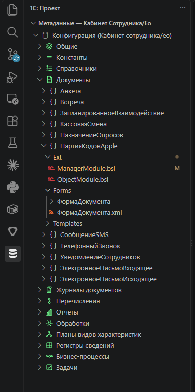
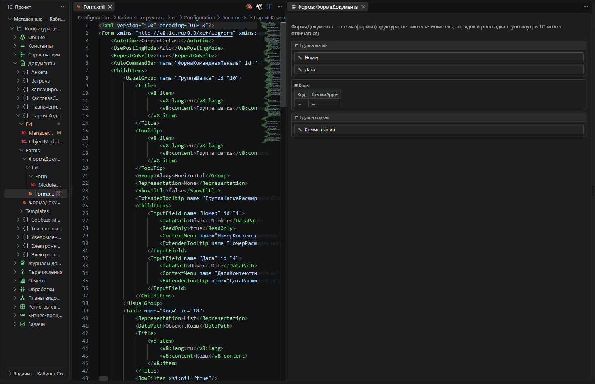
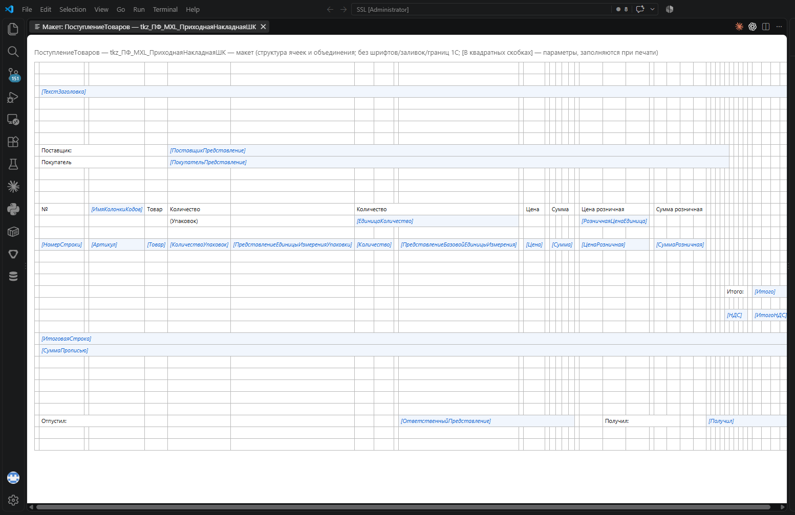

# 1С QazDefense Tools

Расширение VS Code для повседневной работы с несколькими базами 1С в одном
репозитории: запуск, переключение базы, дерево метаданных (конфигурация +
расширения + внешние отчёты/обработки), ER-диаграммы связей, заимствование
объектов в расширение — без похода в Конфигуратор ради каждой мелочи.

Три панели в Activity Bar:

## «1С» — Базы 1С

Список профилей баз (`.1С/base-profiles/*.psd1`) с меткой активной. Клик —
переключение (`.1С/switch-base.ps1`).

## «1С: проект» — активная база

Заголовки панелей показывают имя активной базы и обновляются при
переключении.

- **Задачи** — список задач `.vscode/tasks.json` (Предприятие, Конфигуратор,
  деплой). Ожидает задачи с именами:
  - `1С: Запустить Предприятие`
  - `1С: Открыть Конфигуратор`
  - `1С: Загрузить изменённые объекты`
  - `1С: Загрузить изменённые объекты + обновить БД`
  - `1С: Обновить конфигурацию БД`

  Если задачи с таким именем нет в воркспейсе — VS Code покажет стандартную
  ошибку "task not found", ничего не сломается.

- **Метаданные** — дерево активной базы, читает XML-выгрузку
  (`DumpConfigToFiles`) прямо с диска:
  - «Конфигурация» + каждое расширение из `Extensions/*` отдельным корнем;
    плюс «Внешние отчёты/обработки» из сиблингов вида `ExternalReports/*`,
    `ExternalDataProcessors/*`, если они есть у базы.
  - Категории сгруппированы и упорядочены как в самом Конфигураторе: узел
    «Общие» (подсистемы, общие модули, роли, планы обмена и т.п.) отдельно
    от бизнес-объектов (Справочники, Документы, Регистры...), у каждой
    категории своя иконка.
  - Объекты, заимствованные в расширении (`ObjectBelonging=Adopted`),
    помечены «заимствован».
  - Кэш на категорию — второе и последующие раскрытия того же узла не лезут
    на диск заново; сбрасывается кнопкой «Обновить» или сменой базы.

  

  Правый клик на объекте:
  - **ER-диаграмма объекта** — вкладка с Mermaid-графом: сам объект и его
    прямые ссылочные реквизиты/измерения на другие объекты. Библиотека
    Mermaid зашита в расширение, интернет не нужен.
  - **Визуализация формы** (на `Form.xml` или папке формы) — структура
    полей/групп/таблиц формы.

    

  - **Просмотр макета** (на файле макета или его папке) — предпросмотр
    табличного документа без открытия Конфигуратора.

    

  - **Предопределённые элементы** — список предопределённых элементов
    объекта (справочники, планы видов характеристик, перечисления и т.п.
    — там, где они вообще бывают).
  - **Фильтр по подсистеме (вкл/выкл)** — сузить дерево метаданных до
    объектов одной подсистемы; снимается кнопкой в заголовке панели или
    повторным вызовом той же команды.
  - **Копировать путь объекта** — путь до XML-выгрузки объекта в буфер
    обмена.
  - **Заимствовать в расширение** (только для объектов основной
    конфигурации) — генерирует лёгкий стаб-дескриптор
    (`ObjectBelonging=Adopted`) и дописывает ссылку в `Configuration.xml`
    выбранного расширения. Честно: блок `InternalInfo` (TypeId/ValueId)
    стаб не пишет — платформа должна досчитать его сама при
    `/LoadConfigFromFiles`, это не проверено на 100% случаев, поэтому после
    заимствования обязательно прогонять деплой с `-PlanOnly` перед
    `-UpdateDb`.

## Требования

Ничего лишнего: сам репозиторий со структурой `Configurations/<База>/
Configuration`, `Configurations/<База>/Extensions/<Имя>`, `.1С/switch-base.ps1`
и `.1С/base-profiles/*.psd1` (см. `.1С/README.md` в репозитории). Платформа
1С и `1cv8.exe` нужны только для самих задач деплоя/запуска — дерево
метаданных и ER-диаграммы читают файлы с диска напрямую.

## Иконки

Пиктограммы категорий метаданных (справочники, документы, регистры и т.д.) —
собственный оригинальный набор, см. `resources/metadata-icons/README.md`.

## Лицензия

См. `LICENSE.md`.
